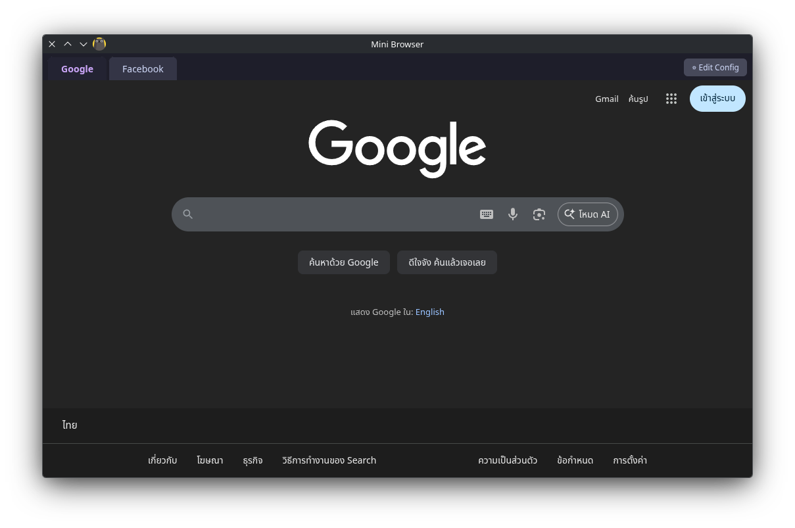

# Mini Browser

> **Vibe coding disclaimer:** This project is built with AI assistance (Claude Code). The code works, but it hasn't been audited for edge cases or production hardening. Use at your own discretion.

## Why?

I want to bunch my many applications such as freshrss into single browser without using desktop version.

## Features

- Tabs with isolated persistent sessions (cookies, storage)
- Split panes per tab — view multiple apps side by side
- Drag-to-resize split panes
- Collapse/expand individual panes via divider buttons
- Find in page (`Ctrl+F` / `Cmd+F`) with match count and prev/next navigation
- Right-click a tab for refresh, sync typing toggle, and per-pane DevTools
- **Sync typing mode** — type in one pane and all panes in the tab receive the same input simultaneously (tmux-style)
- `F12` opens DevTools for all panes in the active tab
- Edit Config button opens `apps.json` in your default editor
- External links open in the system browser

## Config

Config file location: `~/.config/mini-browser/apps.json` (Linux) or the Electron `userData` path on your platform.

Each entry is a tab with a `label` and one or more `panes`:

```json
[
  {
    "label": "Google",
    "panes": [{ "url": "https://google.com", "partition": "persist:google" }]
  },
  {
    "label": "Split",
    "panes": [
      { "url": "https://freshrss.example.com", "partition": "persist:rss" },
      { "url": "https://calendar.google.com", "partition": "persist:cal" }
    ]
  }
]
```

### Pane options

| Field       | Required | Description                                      |
|-------------|----------|--------------------------------------------------|
| `url`       | yes      | Initial URL to load                              |
| `partition` | yes      | Session name — use `persist:` prefix to persist across restarts |

## Sync Typing

Right-click any multi-pane tab and toggle **Sync Typing**. A green ⌨ indicator appears on the tab when active.

While enabled, whatever you type in any pane is forwarded to all other visible panes in that tab simultaneously — like tmux's synchronize-panes mode. Collapsed panes are excluded automatically and re-added when expanded.

**Synced inputs:** characters, `Backspace`, `Delete`, `Enter` (including form submit), `Tab`, `Ctrl+A`, `Ctrl+Z` / `Ctrl+Shift+Z` (undo/redo), `Ctrl+Y`, and any other modifier combinations (e.g. `Ctrl+Enter`).

**Before typing:** click into an editable field (input, textarea, rich text editor) in each pane first — sync targets the currently focused element in each pane.

## What was built in this session

### Sync typing mode (`main.js`, `preload.js`, `renderer/index.html`)

Implemented tmux-style synchronized typing across panes in a tab.

**How it works:**
- `before-input-event` in the main process intercepts keystrokes from the focused webview
- `webContents.isFocused()` guards against feedback loops — only the pane the user is actually typing in forwards events
- Keystrokes are injected into peer panes via `executeJavaScript` + `document.execCommand` (not `sendInputEvent`, which caused app freezes due to triggering `before-input-event` in the target pane and creating a forwarding loop)
- Modifier combos not handled by `execCommand` (e.g. `Ctrl+Enter`) are dispatched as synthetic `KeyboardEvent`s
- `Enter` dispatches a `keydown` event AND submits the nearest `<form>` to support search engines

**Bugs fixed along the way:**
- `sendInputEvent` caused app freeze → replaced with `executeJavaScript`
- Characters not syncing → `char` event type never fires in `before-input-event`; handle printable chars via `keyDown` with `input.key.length === 1`
- Ctrl+F not intercepted on macOS → check now matches both `keyDown` and `rawKeyDown`
- Duplicate `display: none` in `#find-bar` CSS removed
- Collapsed panes excluded from sync group; re-added on expand

## Preview


